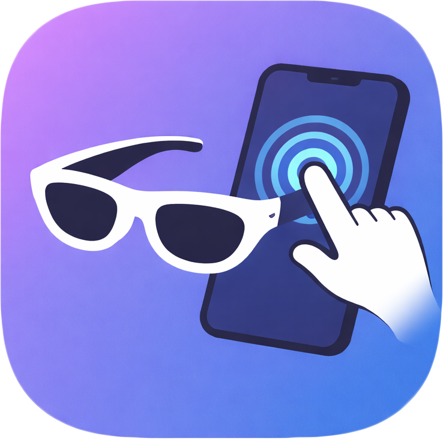
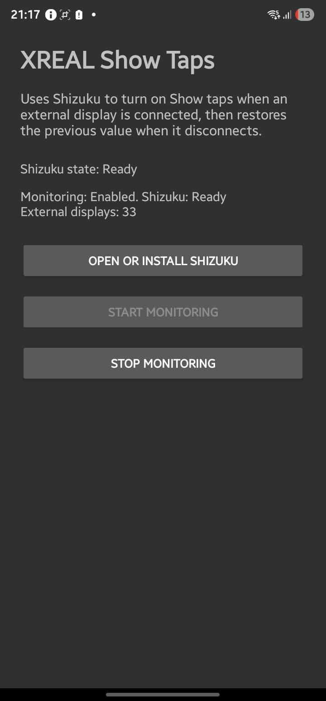

<p align="center">
  
</p>

# XREAL Show Taps

Auto-toggle Android `Show taps` when XREAL glasses connect/disconnect.

## Features

- Detects external display connection (how XREAL usually appears on Android).
- Uses Shizuku to enable `Show taps` on connect.
- Restores the previous `Show taps` value on disconnect.

## Screenshot



## Video

- [Demo video (video.mp4)](./video.mp4)

## Why Shizuku?

Some devices (especially Samsung) block normal apps from writing `show_touches`, even with `Modify system settings`.
Shizuku runs the command through Android's `shell` user so the setting can be changed safely.

## Setup

1. Install Shizuku: https://shizuku.rikka.app/download/
2. Start Shizuku on your phone.
3. Open this project in Android Studio.
4. Build and install the app on your phone.
5. Open the app.
6. Tap `Open or Install Shizuku` if needed.
7. Tap `Start monitoring`.
8. Allow the Shizuku permission prompt.
9. Plug in your XREAL glasses.

## Build APK

From project root:

```powershell
.\gradlew.bat assembleDebug
```

Output APK:
`app\build\outputs\apk\debug\app-debug.apk`

## Notes

- On non-rooted phones, Shizuku usually needs to be started again after reboot.
- Detection is based on any non-default display, so other external displays can also trigger it.
- The app stores and restores the original `Show taps` value automatically.
